[TOC]

# 概述
> 本项目主要记录一些常用图算法，包括基本介绍、原理和示例。

# 一、中心性算法
> 中心性（Centrality）是图谱网络中用以衡量网络中某一节点接近中心程度的一个概念，这个程度用数字表示就被称做中心度，通过中心度的大小来判断节点在网络中的重要程度。

 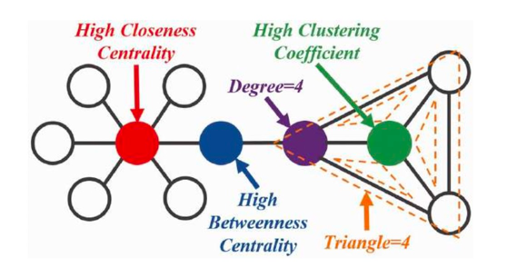

## 1.1 Degree Centrality (度中心性)
> 度中心性是刻画节点中心性的最直接度量指标。节点的度是指一个节点连接的边的数量，一个
节点的度越大就意味着这个节点的度中心性越高，该节点在网络中就越重要。对于有向图，还
要分别考虑出度/入度/出入度。需要注意的是，由于不同的关系网络的规模不同，在互相比较
时，度中心性还要考虑去规模化的问题。

- 度中心性测量一个节点与所有其他节点的**直接相连**的程度，即**一度关联**个数； 
- 在一个包含g个节点的图中，节点i的度中心性是i与其他g-1个节点直接相连的个数；
- 计算公式如下：
  
  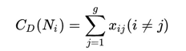

- 为了消除网络规模对度中心性的影响，其标准化公式为：
  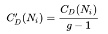
  <br>g为网络节点数，g-1表示网络最大度数；
- 如下图所示，红色节点的度中心性为9；</br> 
  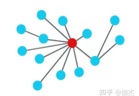
  
- 例如：通过微信好友数量，判断社交圈的广度。


## 1.2 Closeness Centrality (接近中心性)
> 接近中心性反映的是网络中某一节点与其他节点之间的接近程度，用一个节点到所有其他节点的最短路径距离累加求和后取倒数来表示接近性中心性。 
> 接近中心性考虑的本质是每个节点到其它节点的最短路径的平均长度，因此对于一个节点，它距离其他所有节点越近，那么它的接近性中心性越大。

- 计算公式如下, 其中，</br>
  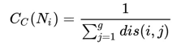
  
- 例如：开一家商场，希望周围顾客到商场的距离都尽可能短，那么它的中心度越高。一般来说，那种需要尽可能多的人使用的设施，它的接近中心度一般越高。

## 1.3 Between Centrality (中介中心性)
> 中介中心性以经过某个节点的最短路径数目来刻画该节
点的重要性。中介中心性的本质是一个节点担任其它任
意两个结点之间最短路径桥梁的次数。一个节点充当
“中介”的次数越高，它的中介中心度就越大。若考虑
标准化的问题，则需要用一个节点承担最短路桥梁的次
数除以所有的最短路径的数量
- 计算公司如下：
  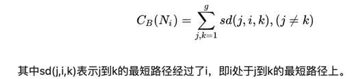

- 例如：在反欺诈场景中，可以使用该指标对中介实体进行识别；在社交圈中，可以使用该指标识别社交达人。

## 1.4 Eigenvector Centrality (特征向量中心性)
> 一个节点的重要程度既取决于邻居节点的数量（节点的度），又取决于邻居节点的重要性。
> 该指标与度中心性相似，但是考虑了邻接节点的重要程度（例如：邻接节点的度）。

- 计算公式如下：
  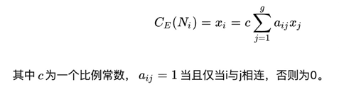


## 1.5 PageRank 
> 一个页面的得分值，由所有链接向它的页面的重要性来决定，到一个
页面的超链接相当于对该页投一票。一个页面的最终PageRank是由
所有链向它的页面的重要性经过迭代得到的，因此在PageRank算法
中，一个有较多链入的页面一般会有较高的得。


- PageRank是特征向量中心性的一个变种。
- PageRank算法最初作为互联网网页重要程度的计算方法，1996年由page和Brin提出，并用于谷歌搜索引擎网页排序。
- 基本思想
  
  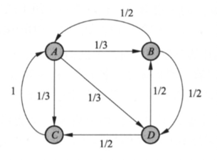
  - 如上图所示，A,B,C,D为四个网页，节点之间的连线表示页面间有超链接进行链接；
  - 边上的权重表示网页间随机跳转的概率，这里采用1/(out_degree)标志；
  - 直观上，一个网页的超链接越多，随机跳转到该网页的概率就越大，其PageRank值就越高。


# 二、分类算法
## k Nearest Neighbors (k 近邻算法)
- 基本思想
    - 假设图中部分节点已经标注了类别，类别可以存放在节点属性上；
    - 给一个待分类节点v和一个正整数k；
    - 计算和v相邻的最近的k个已经标注了类别的节点（距离计算可以直接采用邻居的度或者余弦距离）；
    - 对k个节点的类别进行数量统计，将数量最多的节点类别赋值给v。

# 三、路径算法

## 3.1 最短路径算法
### 3.1.1 Breadth First Search (广度优先算法)
- 广度优先遍历从某个顶点v出发，首先访问该顶点并标记为已访问，然后顺序访问其邻接节点{v1,v2...vj}并标记为已访问,
  然后对{v1,v2...vj}中所有节点重复节点v的操作，直到所有节点均被访问。
  
- 适用于无权图。
  
- 步骤：
    1. 使用辅助队列q，首先将v入队，将其标记为已访问，然后循环判断队列是否为空；
    2. 如果队列不为空，取出队列第一个元素，并将其所有关联的未被访问节点入队，标记为已访问；
    3. 如果队列为空，则已遍历所有节点。
 
    
### 3.1.2 Dijkstra（迪杰斯特拉算法）
- 使用类似**广度优先搜索**的方法和**贪心策略**解决单源最短路径问题，只能求解非负权重图。
- 基本思想：
    - 指定起始点s；
    - 引进两个集合S和U，S的作用是记录已经求出最短路径的顶点以及其最短路径，U则是还未求出最短路径的顶点和距离起点距离；
    - 初始化时，S为空；U中s距离为0，其余各点距离为inf; 
    - 然后从U中找出路径最短的顶点v（认为该点已经找到最短路径），将其加入S中，接着更新U中与v相连的顶点距离；
    - 重复上一步操作，直到U为空。
    - 一个未确认最短路径的点要想找到最短路径，必须经过已经确认了最短路径的点。
  
- 参考
  - https://zhuanlan.zhihu.com/p/40338107
    
- 示例
  
  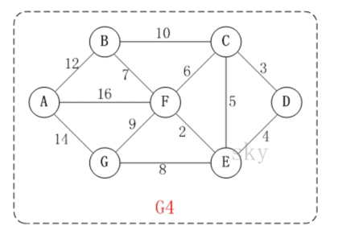
  
- 以上图为例，起始点为D，求其余各点到D的最短距离
    - 初始化
     
         |S  |U  |
         |---|---|
         | |D(0,DD)|
         | |A(inf,)|
         | |B(inf,)|
         | |G(inf,)|
         | |F(inf,)|
         | |C(inf,)|
         | |E(inf,)|
    
    - 从U中选取距离最小的点D，加入S，并更新U（仅更新与D相邻的节点）
     
         |S  |U  |更新操作|
         |---|---|---|
         |D(0,DD)|||
         | |A(inf,)||
         | |B(inf,)|
         | |G(inf,)|
         | |F(inf,)|
         | |C(3,DC)|inf>dist(D,D)+dist(D,C)=3, 更新|
         | |E(4,DE)|inf>dist(D,D)+dist(D,E)=4, 更新|
    
    - 从U中选出距离最小的点C，加入S，并更新U(仅更新与C相连且不在S中的点)

         |S  |U  |更新操作|
         |---|---|---|
         |D(0,DD) |A(inf,)||
         |C(3,DC)|B(13,DCB)|inf>dist(D,C)+dist(C,B), 更新|
         | |G(inf,)|
         | |F(9,DCF)|inf>dist(D,C)+dist(C,F), 更新|
         | |E(4,DE)|4<dist(D,C)+dist(C,E)=8,不更新|

    - 从U中选出距离最小点E，加入S，并更新U
       
         |S  |U  |更新操作|
         |---|---|---|
         |D(0,DD) |A(inf,)||
         |C(3,DC)|B(13,DCB)||
         |E(4,DE)|G(12,DEG)|inf>dist(DE,EG)=12, 更新|
         |    |F(6,DEF)|9>dist(D,E)+dist(E,F)=6, 更新|
    
    - 从U中选出距离最小点F，加入S，并更新U
       
         |S  |U  |更新操作|
         |---|---|---|
         |D(0,DD) |A(22,DEFA)|inf>dist(D,F)+dist(F,A)=22, 更新|
         |C(3,DC)|B(13,DCB#DEFB)|13==dist(D,F)+dist(F,B), 更新|
         |E(4,DE)|G(12,DEG)|12<dist(D,F)+dist(F,G)=15, 不更新|
         | F(6,DEF)||
    
    - 从U中选出距离最小点G，加入S，并更新U
       
         |S  |U  |更新操作|
         |---|---|---|
         |D(0,DD) |A(22,DEFA)|22<dist(D,G)+dist(G,A)=26, 不更新|
         |C(3,DC)|B(13,DCB#DEFB)|
         |E(4,DE)|
         |F(6,DEF)||
         |G(12,DEG)||
    
    - 从U中选出距离最小点B，加入S，并更新U
       
         |S  |U  |更新操作|
         |---|---|---|
         |D(0,DD) |A(22,DEFA)|22<dist(D,B)+dist(B,A)=25, 不更新|
         |C(3,DC)|
         |E(4,DE)|
         |F(6,DEF)||
         |G(12,DEG)||
         |B(13,DCB#DEFB)||
    
    - 从U中选出距离最小点A，加入S
       
         |S  |U  |
         |---|---|
         |D(0,DD) ||
         |C(3,DC)|
         |E(4,DE)|
         |F(6,DEF)||
         |G(12,DEG)||
         |B(13,DCB#DEFB)||
         |A(22,DEFA)||
    
    - U中节点为空，结束

- 为何不能求解带负权重的图？

    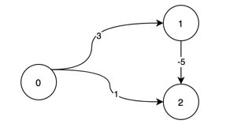

    - 如上图所示，假如要求解0到2的最短距离，采用dijkstra算法
    - 第一步取出0节点，最短距离为0，与0相连节点为1和2，更新1、2距离为3和1
    - 第二步取出2号节点，其最短距离为1，但是从图中可以看出，其最短距离应该为-2
    
- 伪代码
```
# 起始点s, 节点数N
S = []

# s位置为0，其余为无穷
for v in V and v!=s:
    U[v] = inf  
U[s] = 0

for i in range(N):
    v_min = min(U)   # 从U中选出距离s最小的点
    S.append(U.pop(v_min))  # 将v_min从U中删除，并加入S
    for v in v_min.neighbors():  # 对每个v_min邻居进行更新操作
        if dist(v) > dist(v_min) + w(v_min, v):
            dist(v) = dist(v_min) + w(v_min, v)
```

- tigerGraph代码
    - Dijsktra 算法在tiger graph中无法并行处理，不推荐使用,这里采用 SPFA 算法实现无负权重最短路径。
    


### 3.1.3 A* (A star)
- A star 算法在Dijkstra的基础上进行扩展，其节点优先级为：f(n)=g(n)+h(n)
    - f(n)为节点n的综合优先级，当我们选择下一个需要遍历的节点时，从综合优先级最高的节点中选取；
    - g(n)为节点n到起始点的代价；
    - h(n)为节点n到终点的预计代价，也就是A*算法的启发函数；
    - 当g(n)为0，则A*退化为最优优先搜索，速度最快，但可能找不到最优解；
    - 当h(n)为0，则A*退化为Dijkstra；
    - 如果h(n)不大于n到目标的实际距离，则一定可以找出最优解，且h(n)越小，需要查找的路径越多，效率越低；
    - 常见的启发函数有：欧几里得距离、曼哈顿距离、切比雪夫距离等。
    
- 算法步骤：
    ```
    初始化open_list和close_list，分别表示待遍历的节点和已经遍历的节点；
    计算起始节点f值，把起始节点加入open_list；
    重复以下步骤：
        遍历open_list, 查找f值最小的节点，并把它作为当前要处理的节点，然后移到close_list中；
        对当前要处理的节点，对其邻接节点一一检查：
            如果邻接节点不可达或者在close_list中，忽略；
            如果邻接节点不在open_list中，把它加入open_list，并把其父亲节点设置为当前节点；
            如果邻接节点已经在open_list中，检查经过当前节点的路径和原始路径哪个更近，如果经过当前节点路径更近，则设置当前节点为其父亲节点，并更新其f值；
        遍历停止条件：
            如果终点已经加入到open_list，此时路径已经找到，停止查询；
            如果open_list为空，此时查询失败，不存在最短路径；
    ```

### 3.1.4 Floyd-Warshall (弗洛伊德算法)
> Floyd 算法是解决**任意两点**之间最短路径的一种算法，可以处理带有**负权重**最短路径问题。

- 参考
  - https://juejin.cn/post/6844903833382944781
    
- 基本思想
    - 动态规划，转移方程：Dist(i, j) = min(Dist(i, j), Dist(i, k)+Dist(k,j))；
    - 构造两个矩阵D, P分别表示(i,j)之间的路径权重和(i,j)之间经过的节点k，即存放路径；
    - 遍历所有节点，把节点作为中间节点，根据转移方程更新D和P；
    - 遍历结束，则D中(i, j)为最短路径权重，P中(i,j)为i到j经过的节点；
    
- 示例
  
    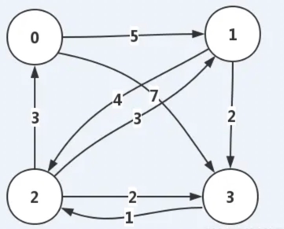

- 初始化，构造矩阵D， P
    
    |D  |0  |1  | 2 |3  |
    |---|---|---|---|---|
    |0  |0  |5  |inf|7  |
    |1  |inf|0  |4  |2  |
    |2  |3  |3  |0  |2  |
    |3  |inf|inf|1  |0  |
   
    |P  |0  |1  | 2 |3  |
    |---|---|---|---|---|
    |0  |-1 |-1 |-1|-1  |
    |1  |-1 |-1 |-1 |-1 |
    |2  |-1 |-1  |-1 |-1 |
    |3  |-1 |-1  |-1  |-1 |

- 开始遍历所有节点，作为中间节点
    - 需要计算的所有路径[{0,1},{0,2},{0,3},{1,0},{1,2},{1,3},{2,0},{2,1},{2,3},{3,0},{3,1},{3,2}]

- 以节点0作为中间节点
    - dist(0,0)+dist(0,1)==dist(0,1) 不更新；
    - dist(0,0)+dist(0,2)==dist(0,2) 不更新；
    - dist(0,0)+dist(0,3)==dist(0,3) 不更新；
    - dist(1,0)+dist(0,0)==dist(1,0) 不更新;
    - dist(1,0)+dist(0,2)>dist(1,2) 不更新；
    - dist(1,0)+dist(0,3)>dist(1,3) 不更新；
    - dist(2,0)+dist(0,0)==dist(2,0) 不更新；
    - dist(2,0)+dist(0,1)>dist(2,1) 不更新；
    - dist(2,0)+dist(0,3)>dist(2,3) 不更新；
    - dist(3,0)+dist(0,0)==dist(3,0) 不更新；
    - dist(3,0)+dist(0,1)==dist(3,1) 不更新；
    - dist(3,0)+dist(0,2)>dist(3,2) 不更新；
    - 本轮更新后：
    
        |D  |0  |1  | 2 |3  |
        |---|---|---|---|---|
        |0  |0  |5  |inf|7  |
        |1  |inf|0  |4  |2  |
        |2  |3  |3  |0  |2  |
        |3  |inf|inf|1  |0  |
       
        |P  |0  |1  | 2 |3  |
        |---|---|---|---|---|
        |0  |-1 |-1 |-1|-1  |
        |1  |-1 |-1 |-1 |-1 |
        |2  |-1 |-1 |-1 |-1 |
        |3  |-1 |-1 |-1  |-1 |

- 以节点1作为中间节点
    - dist(0,1)+dist(1,1)==dist(0,1) 不更新;
    - dist(0,1)+dist(1,2)=9 < dist(0,2)=inf 更新；
    
        |D  |0  |1  | 2 |3  |
        |---|---|---|---|---|
        |0  |0  |5  |9 |7  |
        |1  |inf|0  |4  |2  |
        |2  |3  |3  |0  |2  |
        |3  |inf|inf|1  |0  |
       
        |P  |0  |1  | 2 |3  |
        |---|---|---|---|---|
        |0  |-1 |-1 |1  |-1  |
        |1  |-1 |-1 |-1 |-1 |
        |2  |-1 |-1 |-1 |-1 |
        |3  |-1 |-1 |-1  |-1 |
    - dist(0,1)+dist(1,3) > dist(0,3) 不更新;
    - dist(1,1)+dist(1,0) == dist(1,0) 不更新；
    - dist(1,1)+dist(1,2) == dist(1,2) 不更新;
    - dist(1,1)+dist(1,3) == dist(1,3) 不更新；
    - dist(2,1)+dist(1,0) > dist(1,0) 不更新；
    - dist(2,1)+dist(1,1) == dist(2,1) 不更新；
    - dist(2,1)+dist(1,3) > dist(2,3) 不更新；
    - dist(3,1)+dist(1,0) == dist(3,0) 不更新；
    - dist(3,1)+dist(1,1) == dist(3,1) 不更新；
    - dist(3,1)+dist(1,2) > dist(3,2) 不更新；
    - 本轮更新后：
      
        |D  |0  |1  | 2 |3  |
        |---|---|---|---|---|
        |0  |0  |5  |9  |7  |
        |1  |inf|0  |4  |2  |
        |2  |3  |3  |0  |2  |
        |3  |inf|inf|1  |0  |
       
        |P  |0  |1  | 2 |3  |
        |---|---|---|---|---|
        |0  |-1 |-1 |1  |-1  |
        |1  |-1 |-1 |-1 |-1 |
        |2  |-1 |-1 |-1 |-1 |
        |3  |-1 |-1 |-1  |-1 |
   
- 以节点2作为中间节点
    - dist(0,2)+dist(2,1)>dist(0,1) 不更新；
    - dist(0,2)+dist(2,2)==dist(0,2) 不更新；
    - dist(0,2)+dist(2,3)>dist(0,3) 不更新；
    - dist(1,2)+dist(2,0)==7<dist(1,0)==inf 更新;
      
        |D  |0  |1  | 2 |3  |
        |---|---|---|---|---|
        |0  |0  |5  |9  |7  |
        |1  |7  |0  |4  |2  |
        |2  |3  |3  |0  |2  |
        |3  |inf|inf|1  |0  |
       
        |P  |0  |1  | 2 |3  |
        |---|---|---|---|---|
        |0  |-1 |-1 |1  |-1  |
        |1  | 2 |-1 |-1 |-1 |
        |2  |-1 |-1 |-1 |-1 |
        |3  |-1 |-1 |-1  |-1 |
    - dist(1,2)+dist(2,2)==dist(1,2) 不更新；
    - dist(1,2)+dist(2,3)>dist(1,3) 不更新；
    - dist(2,2)+dist(2,0)==dist(2,0) 不更新；
    - dist(2,2)+dist(2,1)==dist(2,1) 不更新；
    - dist(2,2)+dist(2,3)==dist(2,3) 不更新；
    - dist(3,2)+dist(2,0)=4 < dist(3,0)==inf 更新；
      
        |D  |0  |1  | 2 |3  |
        |---|---|---|---|---|
        |0  |0  |5  |9  |7  |
        |1  |7  |0  |4  |2  |
        |2  |3  |3  |0  |2  |
        |3  |4  |inf|1  |0  |
       
        |P  |0  |1  | 2 |3  |
        |---|---|---|---|---|
        |0  |-1 |-1 |1  |-1  |
        |1  | 2 |-1 |-1 |-1 |
        |2  |-1 |-1 |-1 |-1 |
        |3  |2  |-1 |-1  |-1 |
    - dist(3,2)+dist(2,1)=4 < dist(3,1)==inf 更新；
      
        |D  |0  |1  | 2 |3  |
        |---|---|---|---|---|
        |0  |0  |5  |9  |7  |
        |1  |7  |0  |4  |2  |
        |2  |3  |3  |0  |2  |
        |3  |4  |4  |1  |0  |
       
        |P  |0  |1  | 2 |3  |
        |---|---|---|---|---|
        |0  |-1 |-1 |1  |-1  |
        |1  | 2 |-1 |-1 |-1 |
        |2  |-1 |-1 |-1 |-1 |
        |3  |2  |2  |-1  |-1 |
    - dist(3,2)+dist(2,2) == dist(3,2) 不更新；
    - 本轮更新后：
      
        |D  |0  |1  | 2 |3  |
        |---|---|---|---|---|
        |0  |0  |5  |9  |7  |
        |1  |7  |0  |4  |2  |
        |2  |3  |3  |0  |2  |
        |3  |4  |4  |1  |0  |
       
        |P  |0  |1  | 2 |3  |
        |---|---|---|---|---|
        |0  |-1 |-1 |1  |-1  |
        |1  | 2 |-1 |-1 |-1 |
        |2  |-1 |-1 |-1 |-1 |
        |3  |2  |2  |-1  |-1 |
    
- 以节点3作为中间节点
    - dist(0,3)+dist(3,1)>dist(0,1) 不更新；
    - dist(0,3)+dist(3,2)=8 < dist(0,2)=9 更新；
      
        |D  |0  |1  | 2 |3  |
        |---|---|---|---|---|
        |0  |0  |5  |8  |7  |
        |1  |7  |0  |4  |2  |
        |2  |3  |3  |0  |2  |
        |3  |4  |4  |1  |0  |
       
        |P  |0  |1  | 2 |3  |
        |---|---|---|---|---|
        |0  |-1 |-1 | 3 |-1  |
        |1  | 2 |-1 |-1 |-1 |
        |2  |-1 |-1 |-1 |-1 |
        |3  |2  |2  |-1  |-1 |
        
    - dist(0,3)+dist(3,3)==dist(0,3) 不更新；
    - dist(1,3)+dist(3,0)=6 < dist(1,0)=7 更新;
      
        |D  |0  |1  | 2 |3  |
        |---|---|---|---|---|
        |0  |0  |5  |8  |7  |
        |1  |6  |0  |4  |2  |
        |2  |3  |3  |0  |2  |
        |3  |4  |4  |1  |0  |
       
        |P  |0  |1  | 2 |3  |
        |---|---|---|---|---|
        |0  |-1 |-1 |3  |-1  |
        |1  | 3 |-1 |-1 |-1 |
        |2  |-1 |-1 |-1 |-1 |
        |3  |2  |2  |-1  |-1 |
    - dist(1,3)+dist(3,2)=3 < dist(1,2)=4 更新；
      
        |D  |0  |1  | 2 |3  |
        |---|---|---|---|---|
        |0  |0  |5  |8  |7  |
        |1  |6  |0  |3  |2  |
        |2  |3  |3  |0  |2  |
        |3  |4  |4  |1  |0  |
       
        |P  |0  |1  | 2 |3  |
        |---|---|---|---|---|
        |0  |-1 |-1 |3  |-1  |
        |1  | 3 |-1 |3  |-1 |
        |2  |-1 |-1 |-1 |-1 |
        |3  |2  |2  |-1 |-1 |
    - dist(1,3)+dist(3,3)>dist(1,3) 不更新；
    - dist(2,3)+dist(3,0)>dist(2,0) 不更新；
    - dist(2,3)+dist(3,1)>dist(2,1) 不更新；
    - dist(2,3)+dist(3,3)>dist(2,3) 不更新；
    - dist(3,3)+dist(3,0)==dist(3,0) 不更新；
    - dist(3,3)+dist(3,1)==dist(3,1) 不更新；
    - dist(3,3)+dist(3,2)>dist(3,2) 不更新；
    - 本轮更新后：
    
        |D  |0  |1  | 2 |3  |
        |---|---|---|---|---|
        |0  |0  |5  |8  |7  |
        |1  |6  |0  |3  |2  |
        |2  |3  |3  |0  |2  |
        |3  |4  |4  |1  |0  |
       
        |P  |0  |1  | 2 |3  |
        |---|---|---|---|---|
        |0  |-1 |-1 |3  |-1 |
        |1  | 3 |-1 |3  |-1 |
        |2  |-1 |-1 |-1 |-1 |
        |3  |2  |2  |-1 |-1 |

- 根据D, P矩阵查看结果
    - {1,2}之间最短路径权重为3，路径为1—>3->2
    - {0,2}之间最短路径权重为8，路径为0->3->2
    - {1,0}之间最短路径权重为6，路径为1->3->0, 又3->0经过2,最终路径为1->3->2->0


- 伪代码
```
# N个节点
# 遍历所有节点，作为中间节点，查看以k为中间节点是否能缩短两个顶点之间距离
for k in range(N):
    for i in range(N):
        for j in range(N):
            if dist(i,j) > dist(i,k)+dist(k,j):
                dist(i,j) = dist(i,k)+dist(k,j)

        # 检查负环
        if dist(i, i) < 0:
            return "Error"
    
```


### 3.1.5 Bellman-Ford (贝尔曼-福特算法)
> 贝尔曼-福特算法用于计算从单个起始点开始到各节点的最短距离，支持存在负权重的情况。

- 基本思想
    - 松弛函数：d[v]表示从起点s到v的距离，若存在边w(u,v),使得d[v]>d[u]+w(u,v),则更新d[v]=d[u]+w(u,v)；
    - 松弛函数作用：判断是否经过某条边，可以缩短起点到终点的路径权重；
    - 每经过一轮更新，至少能确定一个节点的最小距离；
    - 对图中所有边进行N-1轮松弛操作，得到所有可能的最短路径；
    - 优点：可以处理带负权的情况
    - 缺点：不能处理带有负权环（环路权重之和为负）的情况

- 参考
    - https://www.jianshu.com/p/b876fe9b2338
    - https://juejin.cn/post/6844903661395509262
    
- 示例
    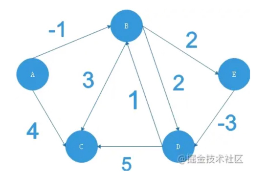

- 边的权重信息
  
    |边|权重w|
    |---|---|
    |AB|-1|
    |AC|4|
    |BE|2|
    |BD|2|
    |BC|3|
    |ED|-3|
    |DB|1|
    |DC|5|

- 初始化，起始点权重为0，其余各点到起始点权重为inf

    |父节点|节点|路径权重|
    |---|---|---|
    | A |A  |0  |
    | |B  |inf|
    | |C  |inf|
    | |D  |inf|
    | |E  |inf|

- 针对存在的各条边依次进行松弛操作（这里为了方便演示，人为选择了每次更新的边，正常情况下是随机选择边,人为选择类似SPFA）
    - 对AB, AC进行松弛操作
        
        |父节点|节点|权重dv|松弛操作|
        |---  |---|---|---|
        | A   |A  |0  |0|
        | A   |B  |-1 |d[B]=inf>d[A]+w(A,B)=-1,更新|
        | A   |C  |4  |d[C]=inf>d[A]+w(A,C)=4，更新 |
        |     |D  |inf|
        |     |E  |inf|

    - 对BE,BD,BC进行松弛操作

        |父节点|节点|权重dv|松弛操作|
        |---  |---|---|---|
        | A   |A  |0  |0|
        | A   |B  |-1 ||
        | B   |C  |2  |d[C]=4<d[B]+w(B,C)=2, 更新|
        |B    |D  |2  |d[D]=inf>d[B]+w(B,D)=2，更新|
        |B    |E  |1  |d[E]=inf>d[B]+w(B,E)=1，更新|
    
    - 对ED,DB,DC进行松弛操作
        
        |父节点|节点|权重dv|松弛操作|
        |---  |---|---|---|
        | A   |A  |0  |0|
        | A   |B  |-1 |d[B]=-1==d[D]+w(D,B)=-1, 不更新|
        | B   |C  |2  |d[C]=2<d[D]+w(D,C)=3, 不更新|
        |E    |D  |-2  |d[D]=2>d[E]+w(E,D)=-2, 更新|
        |B    |E  |1  ||
    
- 第一轮更新后结果

    |父节点|节点|权重dv|
    |---  |---|---|
    | A   |A  |0  |
    | A   |B  |-1 |
    | B   |C  |2  |
    |E    |D  |-2  |
    |B    |E  |1  |

- 按照以上流程进行第二次松弛操作，发现没有节点需要更新，此时结束遍历，最后结果为：
    
    |父节点|节点|权重dv|
    |---  |---|---|
    | A   |A  |0  |
    | A   |B  |-1 |
    | B   |C  |2  |
    | E   |D  |-2  |
    | B   |E  |1  |
  
-  读取结果

    |节点对|权重|路径|
    |---|---|---|
    |A,B|-1 |A->B|
    |A,C|2  |A->B->C|
    |A,D|-2 |A->B->E->D|
    |A,E|1  |A->B->E|

- 伪代码
```
# E是所有边的集合，N是所有节点个数
for i in range(N-1):
    for (u, v) in E:
        if dist(u)+w(u, v) < dist(v):
            dist(v) = dist(u)+w(u, v)

# 检查负权环，经过N-1次更新后，仍能继续更新
for (u, v) in E:
    if dist(u)+w(u, v) < dist(v):
        return "error"
```


### 3.1.6 SPFA （Shortest Path Faster Algorithm）
> 采用队列优化的 bellman-ford 算法，用于求解带权图的单源最短路径，适用于带负权图的情况。

- 基本思想
    - bellman每一轮优化，都会多确定一个点的最短路径，但是每次对所有边进行松弛操作，造成大量的计算冗余；
    - 不难发现，只有那些已经确定了最短路径的点所出发的边才是有效的，因为新确定的点一定要先通过已知最短路径的点；
    - 实际操作中，我们并不能确定哪些点已经确定了最短路径，但是可以放宽条件，已知点必定存在于经松弛后更新的点；
    - SPFA采用队列Q保存经松弛更新的点，然后从这些点发出的边继续松弛操作。

- 参考
    - https://zh.wikipedia.org/wiki/%E6%9C%80%E7%9F%AD%E8%B7%AF%E5%BE%84%E5%BF%AB%E9%80%9F%E7%AE%97%E6%B3%95
    - https://blog.csdn.net/muxidreamtohit/article/details/7894298
    - https://blog.csdn.net/anlian523/article/details/80955066
    - https://zhuanlan.zhihu.com/p/33162490
    
- 示例
  
    
  
- 以上图为例，A为起始点，计算A到其他节点最短路径
- 初始化，队列Q中仅包含一个节点A，距离数组包含其他节点，距离为inf
    
    Q: [A]
  
    | |A|B|C|D|E|
    |---|---|---|---|---|---|
    |d[i]|0|inf|inf|inf|inf|

- A出队，更新与A相连的节点；B，C被松弛，加入队列
    
    Q: [B，C]
  
    | |A|B|C|D|E|
    |---|---|---|---|---|---|
    |d[i]|0|-1|4|inf|inf|
    
- B出队，更新与B相连的节点；C,D,E被松弛，但是C已经在队列，把DE入队
    
    Q: [C,E,D]
  
    | |A|B|C|D|E|
    |---|---|---|---|---|---|
    |d[i]|0|-1|2|1|1|


- C出队，更新与C相连的节点；由于C没有出边，不更新
    
    Q: [E,D]
  
    | |A|B|C|D|E|
    |---|---|---|---|---|---|
    |d[i]|0|-1|2|1|1|

- E出队，更新与E相连的节点；D被松弛，但是已经存在于Q
    
    Q: [D]
  
    | |A|B|C|D|E|
    |---|---|---|---|---|---|
    |d[i]|0|-1|2|-2|1|

- D出队，更新与D相连的节点；没有节点被松弛
    
    Q: []
  
    | |A|B|C|D|E|
    |---|---|---|---|---|---|
    |d[i]|0|-1|2|-2|1|

- Q为空，遍历停止，最终结果为

    | |A|B|C|D|E|
    |---|---|---|---|---|---|
    |d[i]|0|-1|2|-2|1|

- 伪代码
```
# 起始点:s; 队列:Q
# 记录节点入队次数
num_in_Q = {}

# 初始化
for v != s in V(G):
    d(v) = inf
d(s) = 0
Q.append(s)

# 循环遍历
while Q:
    u = Q.pop(0)
    num_in_Q[u] = num_in.get(u, 0) + 1
    
    # 检查负权环,如果一个节点入队次数大于等于节点数N
    if num_in_Q[u] >= N:
        return "Error"
    
    for (u, v) in E(Q):
        if d(u) + w(u, v) < d(v):
            d(v) = d(u) + w(u, v)
            if v is not in Q:
                Q.append(v)
 
```

- 为什么bellman-ford 和 SPFA 不能解决带有负权回路(环路权重和为负)的问题

    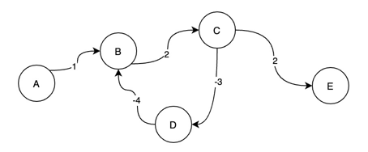

- 以上图为例，采用SPFA进行解释，A为起始点，其中B->C->D->B为负权回路

- 初始化，队列Q中仅包含一个节点A，距离数组包含其他节点，距离为inf
    
    Q: [A]
  
    | |A|B|C|D|E|
    |---|---|---|---|---|---|
    |d[i]|0|inf|inf|inf|inf|

- A出队，更新与A相连的节点；B被松弛，加入队列
    
    Q: [B]
  
    | |A|B|C|D|E|
    |---|---|---|---|---|---|
    |d[i]|0|1|inf|inf|inf|

- B出队，更新与B相连的节点；C被松弛，加入队列
    
    Q: [C]
  
    | |A|B|C|D|E|
    |---|---|---|---|---|---|
    |d[i]|0|1|3|inf|inf|


- C出队，更新与C相连的节点；D,E被松弛，加入队列
    
    Q: [D,E]
  
    | |A|B|C|D|E|
    |---|---|---|---|---|---|
    |d[i]|0|1|3|0|5|

- D出队，更新与D相连的节点；B被松弛，加入队列
    
    Q: [E,B]
  
    | |A|B|C|D|E|
    |---|---|---|---|---|---|
    |d[i]|0|-3|3|0|5|

- E出队，无相连节点，不更新
    
    Q: [B]
  
    | |A|B|C|D|E|
    |---|---|---|---|---|---|
    |d[i]|0|-3|3|0|5|

- **从此开始进入死循环**

- B出队，更新与B相连的节点；C被松弛，加入队列
    
    Q: [C]
  
    | |A|B|C|D|E|
    |---|---|---|---|---|---|
    |d[i]|0|-3|-1|0|5|

- C出队，更新与C相连的节点；D,E被松弛，加入队列
    
    Q: [D,E]
  
    | |A|B|C|D|E|
    |---|---|---|---|---|---|
    |d[i]|0|-3|-1|-4|1|

- 一直循环下去，达不到停止条件......


### 3.1.7 最短路径算法总结
| |采用算法|解决问题|优缺点|时间复杂度（N个节点M条边）|
|---|---|---|---|---|
|dijkstra|广度优先、贪心|单源|不能处理带负权重图,通过队列或者堆排序，可降低复杂度|O(N^2)|
|floyed|动态规划|任意节点|可以处理任意节点之间最短路径问题，包括负权重，可判断负环，复杂度高|O(N^3)|
|bellman-ford|动态规划|单源|可以解决负权重问题，可判断负环|O(NM)|
|SPFA|动态规划+队列优先|单源|可以解决负权重问题，采用优先队列对bellman-ford进行优化，可判断负环|O(KM)(K为节点进入队列平均次数，最差为O(NM))|

## 3.2 random walk (随机游走)
> 随机游走又称为随机游动或者随机漫步，是一种数学统计模型，它是一连串的轨迹组成，其中每一次都是随机的。

- 在图数据库中，随机游走常常作为其他图算法的一部分，如作为机器学习模型训练过程的一部分，这是因为机器学习的输入通常是大小固定的，而图是由任意的顶点和边组成的灵活的结构，因此很难直接应用于机器学习；


## 3.3 cycle detection (环发现)
> 搜索关系网络中的所有环路。环路是首尾相连的路径，不同点、边的类型构成的环路，具有
不同的实际含义。

### 3.3.1 Rocha–Thatte cycle detection algorithm

- 该算法针对有向图。
  
- Rocha–Thatte 示例图  
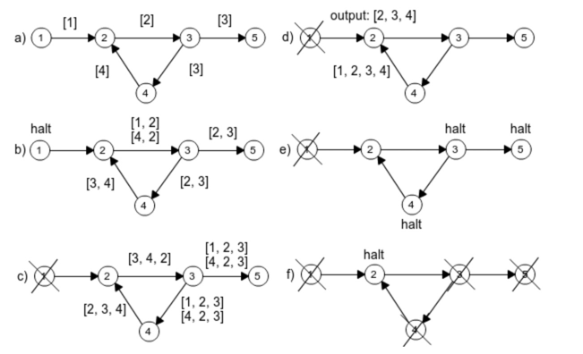
  
- 伪代码
  
    ```
    初始化：每个顶点记录路径仅包含其自己id,设置状态为激活
    重复以下步骤：
        针对每个激活的节点：
            1.将其包含的所有路径列表传送给其出度邻接节点；
            2.节点v,检查收到的每个路径：
                - 如果路径p的第一个id等于自身id(v)，发现环：
                    - 如果id(v)是p中最小的(保证每个环记录一次)，将p返回加入环列表；
                    - 将p从列表中删除；
                - 如果id(v)存在于p，但是不是第一个,将p从列表中删除(环已经在其他路径中被确认);
                - 如果id(v)不在p，将其加入p；
        如果一个节点在上次迭代中没有收到其他节点传输的路径，其状态设置为不激活；
        如果所有节点都是不激活，算法结束。   
    ```

### 3.3.2 Floyd's Cycle Detection Algorithm
> Floyd判圈算法，又称龟兔赛跑算法（Tortoise and Hara Algorithm）,是一个可以在有限状态机、
> 迭代函数或者链表中判断环是否存在，求出环长度，求解环起始点的算法。

- 参考
  
    - https://blog.csdn.net/l947069962/article/details/77774737
    
- 基本思想
    - 如果有限自动状态机、迭代函数或者链表上存在环，那么在换上以不同的速度前进两个指针，必定会在某个时刻相遇。
    - 从同一起始点，同时开始以不同速度前进两个指针，最终相遇，则可以判断存在一个环，且可以求出环长度和环起始点。


- 检测是否有环
    - 初始状态，指针t、h从同一起始点S，分别以速度v，2v前进；
    - 当h无法向前推进时，可以判断没有环存在，若某个时刻h,t相遇，可以判断有环存在。

- 如果存在环，求解环的起点
    - 如果t, h 在M点相遇，只要令h呆在M点，t返回起始点S，然后以相同速度继续前进，即每次前进一步；
    - 当两者再次相遇时，相遇位置即为环的起点P。

- 环起点解法证明
    
  

    - 起始点S到环起始点P距离为m，P到相遇点M的距离为k，环的周长为n;
    - t,h从S分别以v, 2v前进，相遇时，假设t, h 分别在环中走了a圈和b圈；
    - 相遇时t走的路径长度为i=m+k+an, h走的路径为 2i=m+k+bn, 两者相减：i=(b-a)*n, 也就是说t，h当前走的路径为环的整数倍；
    - 将t返回起始点，h呆在相遇点，然后以相同速度每次前进一步，当t走m时，h走了2i+m;
    - 2i+m可以理解为，h先走了m到达环起始点，然后在环里面走了2(b-a)圈回到了起始点；
    - 即当再次相遇时，两者在环的起始点。
    
- 如果存在环，求解环长度
    - 当t, h 分别以不同速度v, 2v前进相遇时，保持h位置不变，让t继续每次前进1步，同时记录t前进步数；
    - 当t, h 再次相遇时，记录步数就是环的长度。


## 3.4 Minimum Spanning Tree (最小生成树)
> 生成树：一个连通图的生成树是指它的一个连通子图，其含有连通图中全部的n个节点，但只
有足以构成一棵树的n-1条边。一颗有n个节点的生成树有且仅有n-1条边，如果生成树中再添
加一条边，则必定会成环。

> 最小生成树：在连通图的所有生成树中，所有边的权重之和最小的生成树，称为最小生成树。

### 3.4.1 Prim's Algorithm

- 参考
  
    - https://zh.wikipedia.org/wiki/%E6%99%AE%E6%9E%97%E5%A7%86%E7%AE%97%E6%B3%95
    - https://www.cnblogs.com/biyeymyhjob/archive/2012/07/30/2615542.html
    
- 基本思路
    - 采用贪心策略；
    - 输入一个加权连通图，顶点集合为V，边集合为E；
    - 初始化：Vnew={x}, 其中x为V中任意节点，Enew={};
    - 重复以下操作，直到Vnew==V:
        - 在边集合E中选取权重最小的边(u,v),u在集合Vnew中，v不在集合Vnew中；如果存在多条边满足条件，任选一个；
        - 将v加入Vnew中，将边(u,v)加入Enew中；
    - 输出：Enew中边及其链接节点，为最小生成树。
    
- 证明（反证法）
    - 命题：假设prim生成的不是最小生成树
    - 假设prim生成的树为T0;
    - 假设存在最小生成树Tmin，使得cost(Tmin)<cost(T0)，则在Tmin中至少存在一条边(u,v)不属于T0；
    - 将(u，v)加入T0，会得到一个环，且(u,v)不是该环的最长边，因为(u,v)是Tmin中的边；
    - 这与prim每次生成最短边相矛盾；
    - 故命题假设不成立。
    

- 示例
  
    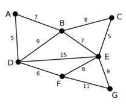

    |id|说明|Vnew|Enew|
    |---|---|---|---|
    |0|初始化,起点为D|{D}|{}|
    |1|可供选择顶点A,B,E,F；选择最短的边DA|{D,A}|{DA}|
    |2|可供选择顶点B,E,F；选择最短的边DF|{D,A,F}|{DA,DF}|
    |3|可供选择顶点B,C,E,G；选择最短边AB|{D,A,F,B}|{DA,DF,AB}|
    |4|可供选择顶点C,E,G；选择最短边BE|{D,A,F,B,E}|{DA,DF,AB,BE}|
    |5|可供选择顶点C,G；选择最短边EC|{D,A,F,B,E,C}|{DA,DF,AB,BE,EC}|
    |6|可供选择顶点G；选择最短边EG|{D,A,F,B,E,C,G}|{DA,DF,AB,BE,EC,EG}|
    |7|Vnew==V,停止|{D,A,F,B,E,C,G}|{DA,DF,AB,BE,EC,EG}|

    生成结果图：
  
    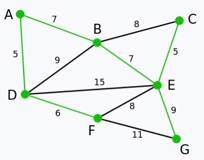
  

### 3.4.2 Kruskal算法

- 基本思路
    - G中包含顶点集合V，边集合E;
    - 新建一个图Gnew，包含G中所有的点，但是不包含边；
    - 将原始E中边按照权重由小到大进行排序，E_sort；
    - 循环的从E_sort中选出边：
        - 如果边的两个顶点不在同一个连通分量中，则添加这条边到G_new中
        - 如果所有顶点都在同一连通分量中，循环停止，Gnew即为最小生成树

# 四、社区发现算法

### 4.1 Louvain Method
> Louvain 算法是一种基于多层次（逐论迭代）优化 Modularity 的算法。Modularity函数用于衡量社区发现的结果的质量，能够刻画发现社区的紧密程度。

- 参考
  
    - https://en.wikipedia.org/wiki/Louvain_method
    - https://www.cnblogs.com/fengfenggirl/p/louvain.html
    - https://www.cnblogs.com/LittleHann/p/9078909.html
    - https://www.yanxishe.com/columnDetail/24701
    
- Modularity定义
    - 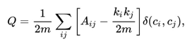
    - Aij为节点i,j之间的权重
    - ki，kj分别为与i, j相连的边的权重和；kj/2m表示j点链接图中其他点的概率，ki*kj/2m表示i链接j点的期望
    - m是图谱中所有边的权重和
    - ci, cj是节点所属的社区
    - delta(ci,cj) = 1 if (ci==cj) else 0
    - 物理含义：社区内节点的连边的权重之和与随机情况下的连边的权重之和的差距
    
- Louvain 基本思想
    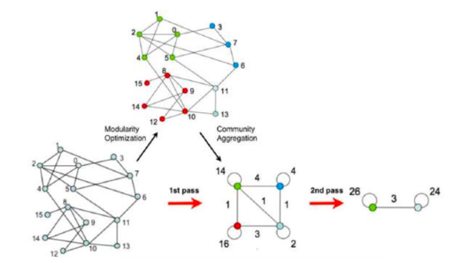
    phrase1:
    1. 初始化时，每个节点属于各自的社区；
    2. 对于节点i，将i从它原来社区转移到与之相连的邻居节点社区，计算delata_Q是否增加；
        - delata_Q计算公式如下
        - 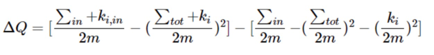
        - sum_in：i移动到的社区权重和
        - sum_tot：i移动到的社区内节点与其他社区相连的权重和
        - ki,in ：i移动到的社区内与i相连的权重和
        - 可以理解为包含两个部分，第一部分为i移动到的社区c，新增i后的社区c的Q值；第二部分为i作为独立社团+原始社团c的Q值之和
    
    3. 如果max(delata_Q)>0，将i分配到delata_Q最大的那个社区，否则保持不变
    4. 重复ii, iii，直到所有社区不在变化
    
    phrase2:
    5. 对图进行压缩,将同一社区节点压缩成一个新的节点，将压缩前两个社区的节点间权重和作为新点边的权重，原社区边权重和作为新的节点边权重
    6. 重复i, ii, iii


## 4.2 Label Propogation Algorithm (LPA)

> LPA认为每个节点的标签应该和其他大多数邻居的标签相同，将一个节点的邻居节点的标签中数量最多的标签作为该节点的标签（类似knn）。
> 给每个节点添加标签以代表该节点所属的社区，并通过标签的传播形成一个社区的内部拥有相同的标签。

- 参考
  
    - https://www.cnblogs.com/LittleHann/p/10699988.html
    - https://en.wikipedia.org/wiki/Label_propagation_algorithm
    - https://blog.csdn.net/ztf312/article/details/78710501

- 基本步骤
    - 初始化给每个节点一个单独的标签，例如：节点1标签为1，节点n标签为n
    - 遍历所有节点，对于节点i，找到其所有邻居，将数量最多的标签赋值给i,如果出现次数最多的标签不止一个，随机选择一个
    - 若本轮更新没有发现节点标签被更新或者达到了设定更新最大轮数，则停止迭代；否则重复以上步骤。
    
- 优缺点
    - 简单高效，由于每次随机更新节点标签，可能导致结果不同。

- 更新方式
    - 同步更新：保存上一轮更新后的图谱快照信息，每个节点更新时，基于上一轮快照信息
      - 对于二分图或者近似二分图（节点可分成两个集合，边上的节点分属于不同的集合），同步更新会导致标签来回震荡
      - 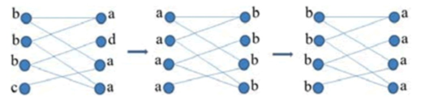
    - 异步更新：每个节点标签更新后立即生效，其他节点在统计邻居节点标签信息时，永远取最新值


## 4.3 TriangleCount (三角形计数)
> 统计一个点集内三角形个数，如果一条边的两个顶点有共同的邻居，则这三个点构成三角形。
> 一个点集内三角形数量越多，代表该点集的节点之间关系越紧密，可以用该指标作为社团分类的标准。

- 基本思想
    - 总的三角形数目：count=0
    - 为每个顶点统计邻居节点集合
    - 对每条边，计算两端节点邻居集合的交集，交集数量为n，count+=n
    - 由于一个三角形包含三条边，则每个三角形计算三次，最后三角形数目为count/3
    

## 4.4 Strong Connection Component (强连通分量)

> 强连通分量：图的子图，在该子图中，任意两点之间都有路径相连，针对有向图。

- 参考
    - http://www.cs.cmu.edu/~guyb/paralg/papers/CoppersmithFHP.pdf

- tigerGraph 中采用 DCSC (Divide-and-Conquer Strong Components) 进行强连通分量发现
    - 定理一：G(V,E)是一个有向图，v是G中任意点,则：Desc(G,v) & Pred(G,v) = SCC(G,v)
        - Desc(G,v)表示从v出发，可以到达的所有节点
        - Pred(G,v)表示可以到达v的所有节点
        - SCC(G,v)表示包含v的一个强连通图
    - 定理二：G是一个包含节点v的图，则G的任一强连通分量是Desc(G,v)、Pred(G,v)、Rem(G,v)的子图
        - Rem(G,v)表示达到v和不能从v到达的顶点 Rem(G,v)=V \ {Desc(G,v) | Pred(G, v)}
    
    - 结合定理一和定理二，采用分治思想识别强连通分量
        - 采用定理一识别出包含v的连通分量
        - 基于定理二，对剩余的三部分继续DCSC
      
        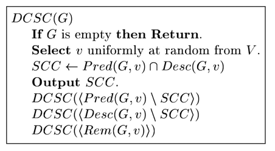


## 4.5 Weakly Connected Components (弱连通分量)
> 弱连通分量：图的子图，在该子图中，任意两点之间都有路径相连，针对无向图。

- 主要思想
    - 初始化每个节点的连通分量id为自身内在id
    - 循环
        - 针对每条边，将较小节点的id赋值给另外一个节点
        - 当所有节点连通分量id不在发生改变，退出循环

## 4.6 Local Clustering Coefficient (局部聚集系数)

> 局部聚集系数用来衡量一个点的邻居与完全图（任意两点之间都存在边）的接近程度；
> 采用邻居节点之间的边数与所有可能边数的比值进行计算。


# 五、相似性
## 5.1 Jaccard Similarity (杰卡德相似性)
- 主要思想
    - 根据邻居节点之间的重合度，计算两个节点的相似性
    
- 计算公式
  
    


## 5.2 Cosine Similarity (余弦相似性)
- 主要思想
    - 将节点属性转为向量，根据余弦定理计算两个向量之间的余弦值
    - 夹角越小，两个向量越相似，即两个节点越相似
    - 在tigerGraph中将两个节点的邻居并集作为特征项
        - 假如A的邻居节点为[1,2,3,4], B的邻居节点为[1,2,3,5],则特征项为[1,2,3,4,5];
        - A，B的特征向量为[1,1,1,1,0], [1,1,1,0,1],这里的1可以采用边权重进行替换
    
- 计算公式
    
    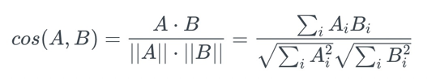

